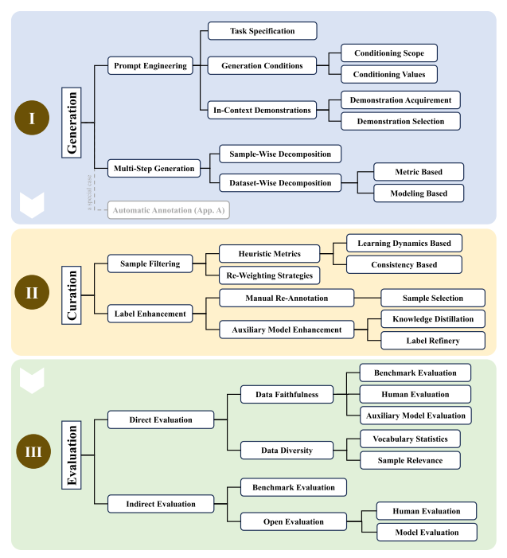

# On LLMs-Driven Synthetic Data Generation, Curation, and Evaluation: A Survey
Source: [PDF](https://arxiv.org/pdf/2406.15126)

The paper explains how to create synthetic data with LLM's. It also specifies three steps: Data Generation, Data Curation, Data Evaluation.

- Data Generation:
    - Prompt Engineering
    - Multi-Step Generation
- Data Curation:
    - Sample filtering
    - Label enhancement
- Data Evaluation:
    - Direct evaluation
    - Indirect evaluation