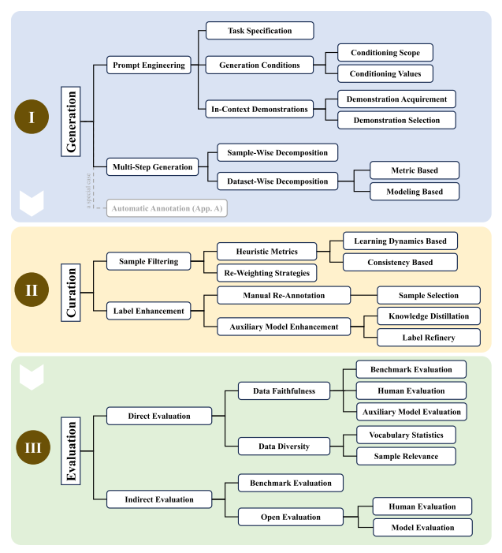

# 101_phd
This report is explaining how I'm doing my phd

## Documents
* [On LLMs-Driven Synthetic Data Generation, Curation, and Evaluation: A Survey](#on-llms-driven-synthetic-data-generation-curation-and-evaluation-a-survey)
* [DataDreamer: A Tool for Synthetic Data Generation and Reproducible LLM Workflows](#datadreamer-a-tool-for-synthetic-data-generation-and-reproducible-llm-workflows)
* [Synthetic Data Generation with Large Language Models for Text Classification: Potential and Limitations](#synthetic-data-generation-with-large-language-models-for-text-classification-potential-and-limitations)

## On LLMs-Driven Synthetic Data Generation, Curation, and Evaluation: A Survey
Source: [PDF](https://arxiv.org/pdf/2406.15126)

The paper explains how to create synthetic data with LLM's. It also specifies three steps: Data Generation, Data Curation, Data Evaluation.

- Data Generation:
    - Prompt Engineering
    - Multi-Step Generation
- Data Curation:
    - Sample filtering
    - Label enhancement
- Data Evaluation:
    - Direct evaluation
    - Indirect evaluation

---

## DataDreamer: A Tool for Synthetic Data Generation and Reproducible LLM Workflows
Source: [PDF](https://arxiv.org/pdf/2402.10379)

### 1. Title, Abstract, and Introduction

#### Title:
**DataDreamer: A Tool for Synthetic Data Generation and Reproducible LLM Workflows**

#### Abstract:
Large language models (LLMs) have become essential tools for NLP research in various tasks, including synthetic data generation, evaluation, fine-tuning, and distillation. However, challenges due to model scale, closed-source nature, and lack of standardized tooling hinder open science and reproducibility. This paper introduces **DataDreamer**, an open-source Python library enabling researchers to implement advanced LLM workflows while promoting best practices for reproducibility. The library is available at [GitHub](https://github.com/datadreamer-dev/DataDreamer).

#### Introduction:
Large language models have revolutionized NLP research through the prompt-and-predict paradigm. However, issues such as closed-source accessibility, technical complexity, and prompt sensitivity hinder reproducibility and sharing. **DataDreamer** addresses these challenges by providing a standardized interface for implementing workflows like synthetic data generation, fine-tuning, and alignment while ensuring reproducibility with caching, reproducibility fingerprints, and open science practices.

### 2. Section and Sub-Section Headings

#### 1. Introduction
#### 2. LLM Workflows
- **Synthetic Data Generation**
- **LLMs for Task Evaluation**
- **Fine-tuning and Alignment**
- **Self-improving LLMs**

#### 3. Demonstration and Examples
#### 4. DataDreamer
- **Installation**
- **Sessions**
- **Steps**
- **Models**
- **Trainers**
- **Caching and Sharing Workflows**
- **Resumability**
- **Sharing Open Data and Open Models**
- **Efficiency and Optimizations**
- **Configuration and Extensibility**

#### 5. Reproducibility
#### 6. Conclusion

##### Appendices:
- **Instruction-Tuning a LLM**
- **Aligning a LLM**
- **Self-Rewarding LLMs**
- **Augmenting an Existing Dataset**
- **Example Synthetic Data Card**

### 3. Mathematical Content

The document contains theoretical frameworks rather than explicit mathematical equations. It discusses concepts like:
- **Reproducibility Fingerprints**: Hash-based uniqueness for workflows.
- **Optimization Techniques**: Multi-GPU processing, quantization, and parameter-efficient fine-tuning.

### 4. Conclusions

The paper emphasizes the critical role of reproducibility in NLP research, proposing **DataDreamer** as a solution to simplify LLM workflows and enable sharing and extension. By standardizing interfaces and automating caching and logging, **DataDreamer** lowers technical barriers while promoting open science and sustainability in research.

### 5. References

The document includes an extensive reference list on topics like:
- **LLM Optimization**
- **Reproducibility Challenges**
- **Applications in NLP Research**

Let me know if you'd like specific references detailed or checked for familiarity.

---

## Synthetic Data Generation with Large Language Models for Text Classification: Potential and Limitations
[PDF](https://arxiv.org/pdf/2310.07849)

### Abstract
The collection and curation of high-quality training data is crucial for developing text classification models with superior performance but often comes at significant cost and time investment. Researchers have recently explored using large language models (LLMs) to generate synthetic datasets as an alternative. However, the effectiveness of LLM-generated synthetic data in supporting model training is inconsistent across different classification tasks. This study examines how model performance varies with the subjectivity of classification. Results suggest subjectivity, at both task and instance levels, negatively affects performance when models are trained on synthetic data. The study concludes with implications for leveraging LLMs for synthetic data generation.

### Introduction
Machine-learning-powered text classification models are widely used in applications like detecting biased or toxic language and filtering spam emails. Their performance heavily relies on the quality of training data, posing challenges for novel tasks or new classification categories due to the complexity and cost of data curation. Recent advancements in LLMs have prompted exploration into generating synthetic data to augment or replace real-world datasets. This study investigates whether LLM-generated synthetic data can match the performance of real-world data for training models, focusing on the impact of task subjectivity.

### Table of Contents
1. [Introduction](#introduction)
2. [Related Work](#related-work)
   - Generative AI in Synthetic Data Generation
   - Large Language Models
3. [Methodology](#methodology)
   - Zero-shot Synthetic Data Generation
   - Few-shot Synthetic Data Generation
4. [Evaluation I: Comparison Across Different Types of Tasks](#evaluation-i-comparison-across-different-types-of-tasks)
   - Datasets and Tasks
   - Task-level Subjectivity Determination
   - Model Training
   - Evaluation Results
   - Exploratory Analysis: Data Diversity
5. [Evaluation II: Comparison Across Different Task Instances](#evaluation-ii-comparison-across-different-task-instances)
   - Instance-level Subjectivity Determination
   - Evaluation Results
6. [Conclusions and Discussions](#conclusions-and-discussions)
   - Why Subjectivity Adversely Impacts the Effectiveness of the Synthetic Data?
   - Explaining a Few Exceptions
   - Limitations and Future Work
7. [Mathematical Content](#mathematical-content)
8. [References](#references)

### Mathematical Content
The formula below represents the instance-level annotation agreement as a proxy for subjectivity:

\[
a_i = \frac{\max_{y \in Y} \sum_{k=1}^{K_i} 1(r^k_i = y)}{K_i}
\]

Where:  
- \( Y \): Set of all possible labels.  
- \( K_i \): Total annotators for instance \( i \).  
- \( r^k_i \): Annotation by \( k \)-th annotator for instance \( i \).  

### Conclusions
The study highlights how subjectivity negatively impacts the utility of LLM-generated synthetic data for training text classification models. While models trained on synthetic data struggle with subjective tasks, guiding synthetic data generation with real-world examples can improve effectiveness. The findings encourage exploring strategies to increase data diversity and better reflect real-world data distributions.

### References
- Zhuoyan Li et al., **Towards Better Detection of Biased Language with Scarce, Noisy, and Biased Annotations**, Proceedings of the 2022 AAAI/ACM Conference on AI, Ethics, and Society.
- Saif Mohammad et al., **SemEval-2018 Task 1: Affect in Tweets**, Proceedings of the 12th International Workshop on Semantic Evaluation.
- Dorottya Demszky et al., **GoEmotions: A Dataset of Fine-Grained Emotions**, ACL 2020.
